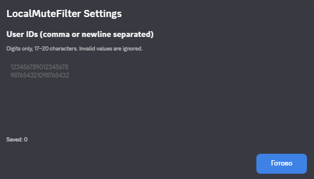

# LocalMuteFilter

**Language / Язык:** English · [Русский](README.ru.md)

A BetterDiscord plugin that locally mutes everyone in your current voice channel except users you explicitly whitelist — and unmutes them the moment you leave.

---

## The problem

In certain activities there is a need to hear only a specific group of people in the channel for a period of time. And from one stage of the activity to the next, that group can change as player roles get reshuffled. Manually setting local mutes every time turns into a routine and a hunt for the right user.

When the activity ends, it would be nice to clear those local mutes as well. And you end up clicking through everyone again just to remove the mute.

## The idea

**LocalMuteFilter flips this around.** Instead of listing who to mute, you list who to *keep*. Everyone else in the channel is muted automatically — locally, for your client only. Nobody else is affected, no server permissions are touched, and the other participants have no idea it's happening.

## How it works

1. You paste a list of Discord user IDs into the plugin's settings panel.
2. When you join a voice channel, the plugin checks every participant:
   - In the whitelist → local mute is **cleared**.
   - Not in the whitelist → local mute is **set**.
3. When someone joins or leaves the channel, the rule is re-applied to the current channel.
4. When *you* leave the channel or switch to another one, all mutes the plugin set are **cleared**, and the rule is applied fresh to the new channel.
5. When you disable the plugin, all its mutes are **cleared**.

The plugin does not poll. It subscribes to Discord's internal `VoiceStateStore` and reacts only to real events (join / leave / move / mute state changes), with a short debounce to smooth out bursts.

## Why local mutes

Discord's *local* mute is a client-side toggle: it silences a user for you only. It is not a server mute, not a self-mute, and it does not require any permissions. It is exactly the checkbox you see in the user's context menu under "Mute" — the plugin simply automates pressing it.

This makes the plugin safe to use anywhere: in servers, in DMs, in group calls. Nobody but you is affected.

## Whitelist semantics

The whitelist is the **single source of truth**:

- If a user is in the whitelist, the plugin guarantees they are *not* locally muted by it.
- If a user is not in the whitelist, the plugin guarantees they *are* locally muted.
- When you leave the channel, the plugin removes every mute it set.

## Configuration

All configuration happens through the plugin's settings panel in BetterDiscord. No file editing is required.

- **User IDs** — one per line, or comma-separated. Only digits, 17–20 characters. Invalid entries are discarded and reported in the panel.

To copy a user ID: enable **Developer Mode** in Discord settings (Settings → Advanced → Developer Mode), then right-click a user and choose **Copy User ID**.

## Requirements

- Discord desktop client
- [BetterDiscord](https://betterdiscord.app/) installed

## Installation

1. Install BetterDiscord.
2. Open Discord → Settings → BetterDiscord → Plugins.
3. Click **Open Plugin Folder**.
4. Place `LocalMuteFilter.plugin.js` into that folder.
5. Enable the plugin in the Plugins list.
6. Click the gear icon next to the plugin name to open settings.

## Notes and limitations

- The plugin relies on Discord's internal Webpack modules (`MediaEngineStore`, `VoiceStateStore`, `UserStore`, and the module exposing `toggleLocalMute`). These are not part of a public API and may change between Discord updates. If the plugin stops working after an update, the module search may need to be adjusted.
- Local mutes live on the client side. The plugin re-applies the rule every time you join a channel.
- The plugin does not modify your account, server settings, or other users' experience in any way.

## License

MIT